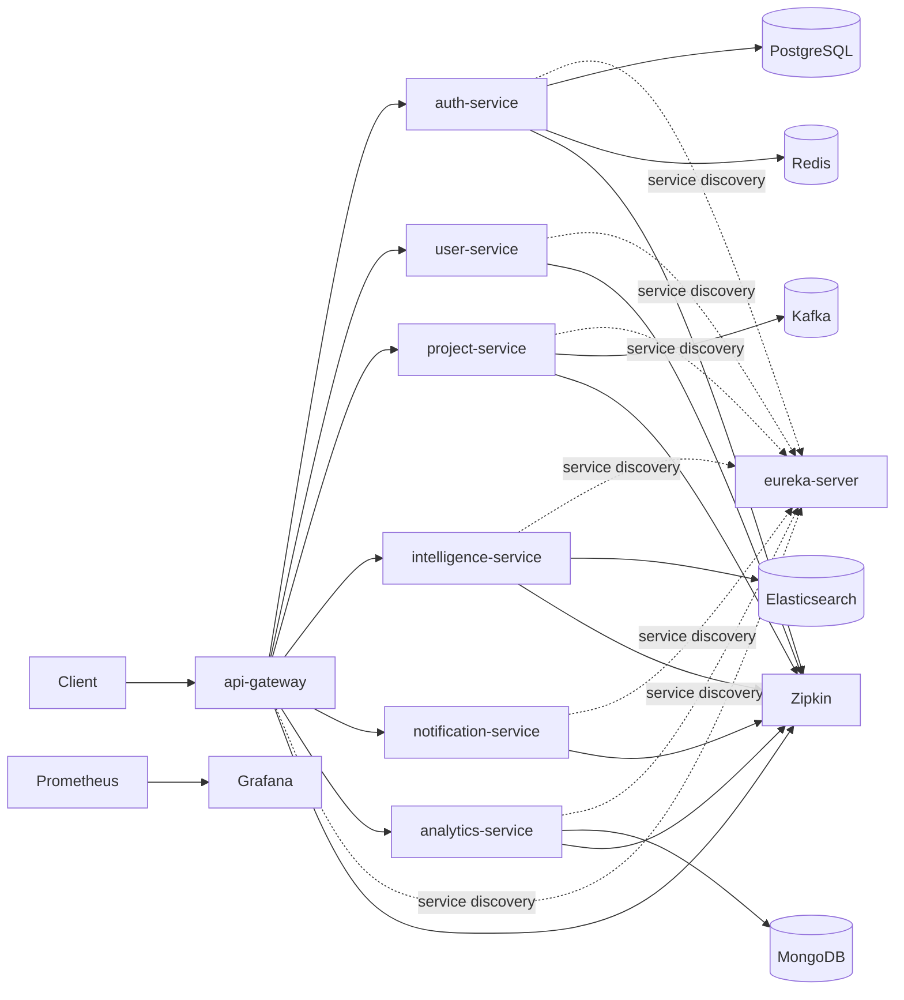

# SmartGig Platform

SmartGig Platform adalah Freelance Intelligence Marketplace berbasis Spring Boot 3.2 microservices.




## Prerequisites

- Docker
- Docker Compose
- Java 21
- Maven 3.9+

## Getting Started

1. Clone repo
2. Masuk ke folder project

```bash
cd smartgig-platform
```

3. Jalankan infrastruktur

```bash
docker-compose up -d
```

4. Build shared library

```bash
mvn install -pl common-lib
```

5. Jalankan service (contoh)

```bash
mvn -pl eureka-server spring-boot:run
mvn -pl api-gateway spring-boot:run
mvn -pl auth-service spring-boot:run
```

## Port Mapping

| Komponen | Port |
| --- | ---: |
| api-gateway | 8080 |
| auth-service | 8081 |
| user-service | 8082 |
| intelligence-service | 8083 |
| project-service | 8084 |
| notification-service | 8085 |
| analytics-service | 8086 |
| eureka-server | 8761 |
| PostgreSQL | 5432 |
| Redis | 6379 |
| Kafka | 9092 |
| Kafka (internal) | 29092 |
| Kafka UI | 8090 |
| MongoDB | 27017 |
| Elasticsearch | 9200 |
| Zipkin | 9411 |
| Prometheus | 9090 |
| Grafana | 3000 |

## Links

- Swagger UI (Auth Service): `http://localhost:8081/swagger-ui.html`
- Kafka UI: `http://localhost:8090`
- Grafana: `http://localhost:3000`
- Zipkin: `http://localhost:9411`
- Eureka Dashboard: `http://localhost:8761`

