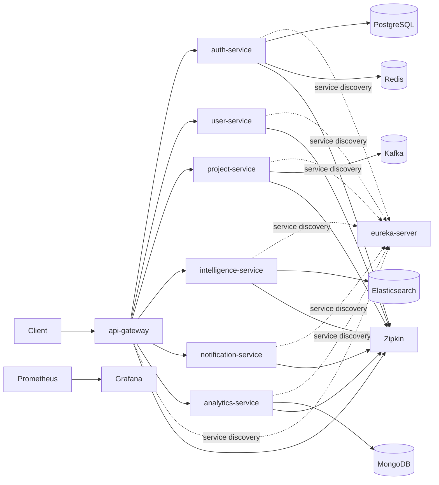

# SmartGig Platform

Freelance Intelligence Marketplace berbasis Spring Boot microservices.



## Overview

SmartGig menggabungkan:
- Event-driven architecture dengan Kafka
- Skill graph untuk matching freelancer dan project
- Intelligence engine untuk matching dan pricing
- Real-time notifications via WebSocket (STOMP)
- Full-text search dengan Elasticsearch
- Distributed tracing via Zipkin
- Observability via Prometheus + Grafana

## Services

| Service | Port | Deskripsi |
|---|---:|---|
| Eureka Server | 8761 | Service discovery |
| API Gateway | 8080 | Entry point, JWT validation, rate limiting |
| Auth Service | 8081 | Auth, JWT tokens, refresh tokens |
| User Service | 8082 | User profiles, skills, skill graph |
| Project Service | 8083 | Projects marketplace, search via Elasticsearch |
| Intelligence Service | 8084 | Matching engine, price prediction |
| Notification Service | 8085 | Kafka consumer + WebSocket push |
| Analytics Service | 8086 | Event logging + Quartz batch jobs |

## Infrastructure

| Component | Port | Link |
|---|---:|---|
| PostgreSQL | 5432 | - |
| Redis | 6379 | Redis Commander `http://localhost:8091` |
| Kafka | 9092 | Kafka UI `http://localhost:8090` |
| MongoDB | 27017 | Mongo Express `http://localhost:8092` |
| Elasticsearch | 9200 | - |
| Zipkin | 9411 | `http://localhost:9411` |
| Prometheus | 9090 | `http://localhost:9090` |
| Grafana | 3000 | `http://localhost:3000` |

## Prerequisites

- Docker
- Docker Compose
- Java 21
- Maven 3.9+

## Getting Started

```bash
cd smartgig-platform
```

```bash
docker-compose up -d
```

```bash
mvn install -pl common-lib
```

```bash
mvn -pl eureka-server spring-boot:run
mvn -pl api-gateway spring-boot:run
mvn -pl auth-service spring-boot:run
```

```bash
make init-kafka
```

## Port Mapping

| Komponen | Port |
| --- | ---: |
| api-gateway | 8080 |
| auth-service | 8081 |
| user-service | 8082 |
| project-service | 8083 |
| intelligence-service | 8084 |
| notification-service | 8085 |
| analytics-service | 8086 |
| eureka-server | 8761 |
| PostgreSQL | 5432 |
| Redis | 6379 |
| Kafka | 9092 |
| Kafka (internal) | 29092 |
| Kafka UI | 8090 |
| MongoDB | 27017 |
| Elasticsearch | 9200 |
| Zipkin | 9411 |
| Prometheus | 9090 |
| Grafana | 3000 |

## Links

- Swagger UI (Auth Service): `http://localhost:8081/swagger-ui.html`
- Kafka UI: `http://localhost:8090`
- Grafana: `http://localhost:3000`
- Zipkin: `http://localhost:9411`
- Eureka Dashboard: `http://localhost:8761`

## Running Tests

```bash
mvn verify -pl auth-service,user-service,project-service
```

